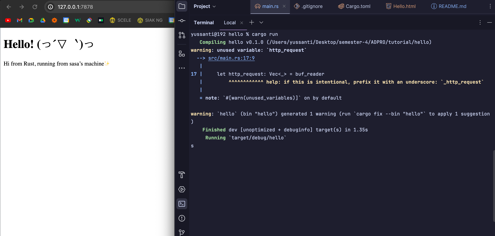
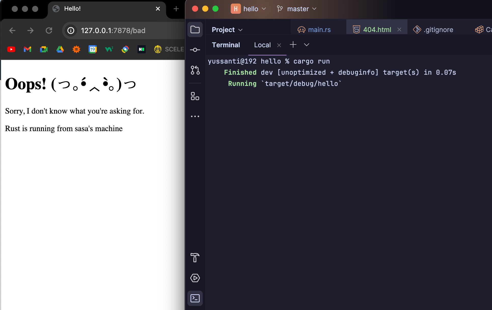

# ✨Reflection🪞
Syazantri Salsabila - AdvProg B - 2206029443 <hr>

1️⃣ Commit 1 Reflection Notes
> ***What is inside the handle_connection method?*** <br>
> Di dalam method ini, ada ```BufReader``` yang me-wrap TcpStream. ```BufReader``` ini bakal nyimpen data berskala besar secara buffering dengan mengelola method calling dari trait std::io::Read. Kemudian data akan dibaca line by line pakai ```.lines()``` sampai line nya habis/empty. Variable yang mengambil line tersebut kita namakan ```http_request``` yang kemudian akan disimpan ke dalam vektor karena kta menggunakan ```Vec<_>``` . 

2️⃣ Commit 2 Reflection Notes <br>
 
> ***What have you learned about the new code the handle_connection.*** <br>
> Pada method handle_connection yang baru, setelah membaca request, method juga akan menghasilkan HTTP response. Isinya adalah status line (```"HTTP/1.1 200 OK"```), header, dan isi dari file ```hello.html``` yang telah diconvert ke String menggunakan ```fs::read_to_string("hello.html").unwrap()```. Konten ini akan menjadi body dari response. Lalu headernya akan berisi content length, dan status line itu berisi versi HTTP yang digunakan pada response.

3️⃣ Commit 3 Reflection Notes

> ***How to split between response and why the refactoring is needed.*** <br>
> * Split between response caranya dengan pakai ```if else``` dengan membaca ```request_line``` apakah isinya ```"GET / HTTP/1.1"``` atau tidak. Jika iya ke hello.html, jika tidak ke 404.html, dan akan ada perbedaan ```status_line``` yang dibuat juga.
> * Kenapa refactoring dibutuhkan, supaya lebih mudah bedain case antara ```if else``` nya (karena sekarang di dalam blok ```if else``` hanya mengandung kondisional perbedaan mereka saja).